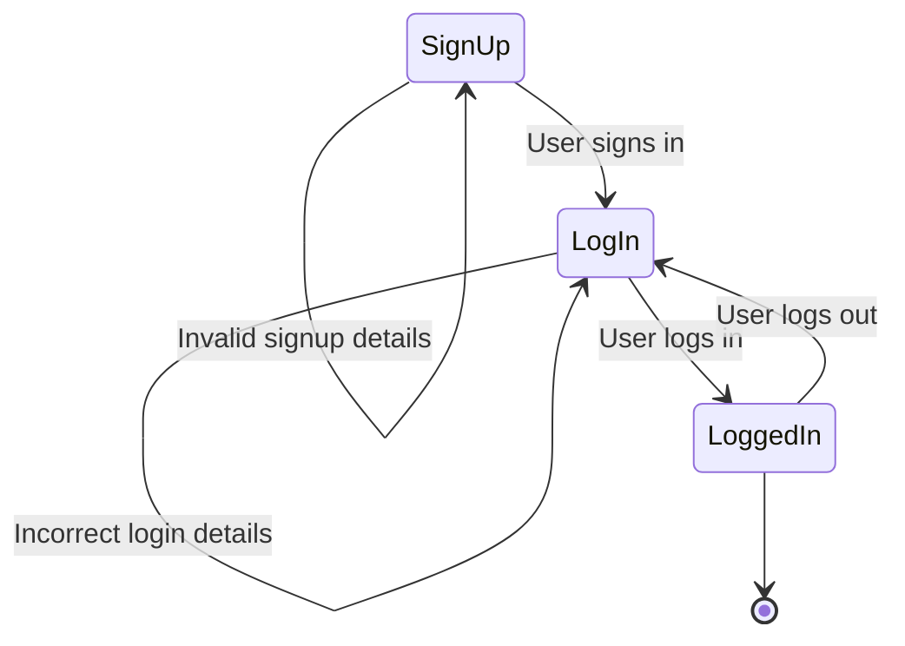

<table>
<tr><td>

|  Identifying States |         
|---|
|  Sign Up Page |
|  Log In Page |
|  Logged In Page |

</td><td>

|  Identifying Events |
|---|
|  User signs up |
|  User logs in |
|  User logs out |

</td></tr> </table>

 

---
title: Simple sample
---

####  State transition table:

|  Initial State | Event  | Next State  |
|---|---|---|
|  Sign-up Page |  Invalid signup details | Sign-up Page  |
|  Sign-up Page |  User signs up | Log In Page  |
|  Log In Page |  Incorrect login details | Log In Page  |
|  Log In Page |  User logs in |  User is logged into the site (Logged In Page) |
|  Logged In page | User logs out  | Log In Page  |

 

#### <u>Test case for states and events/transitions:</u>
* Start: Sign-up Page
* Signs up => Log In Page
* Log in => User is logged into the site(Logged In Page)
* Log out => Log In Page

